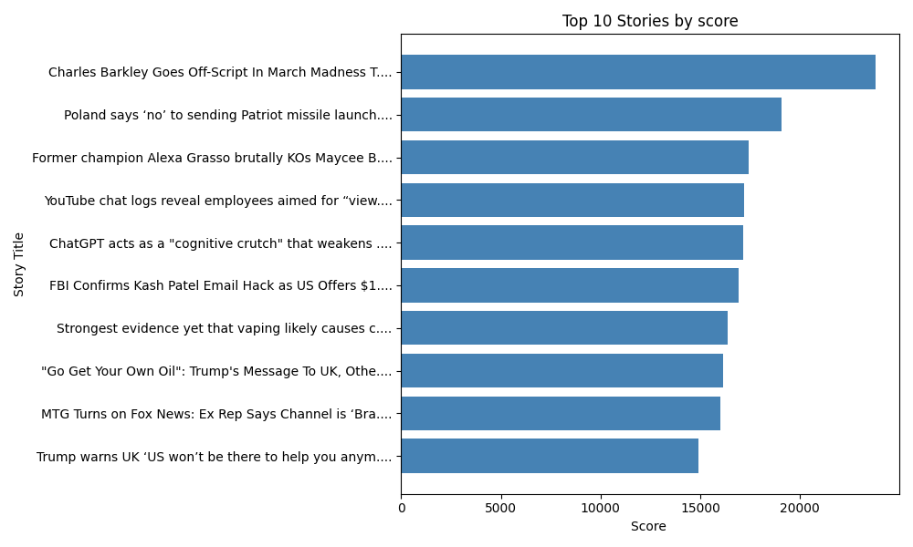
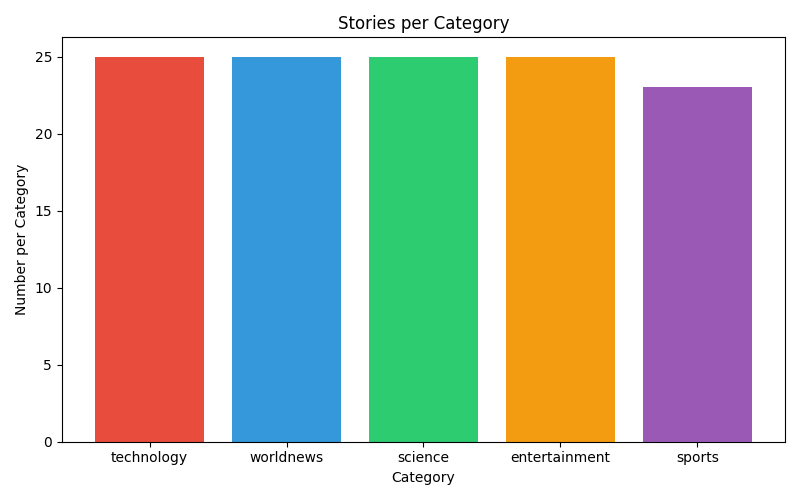
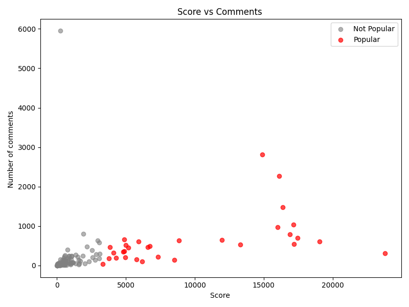
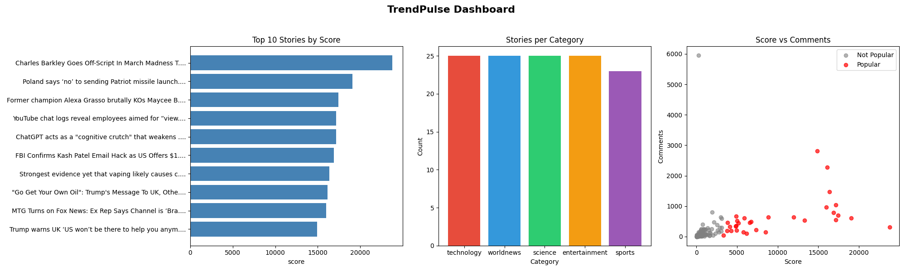

# 🚀 TrendPulse: What's Actually Trending Right Now

> 📌 *This is my first mini project in Data Science & AI/ML, where I built a complete end-to-end data pipeline using real-world Reddit data.*

TrendPulse is an end-to-end data pipeline project that collects, processes, analyzes, and visualizes real-time trending data from Reddit.

---

## 🔑 Keywords

**Data Pipeline • Data Engineering • Data Analysis • Data Visualization • ETL • API Integration • Python • Pandas • NumPy • Matplotlib • JSON Processing • Dashboard**

---

## 📌 Overview

This project demonstrates a complete data workflow:

➡️ Data Collection → Data Cleaning → Data Analysis → Data Visualization

It simulates a real-world data engineering + analytics pipeline using Python.

---

## 🏗️ System Architecture

TrendPulse follows a modular pipeline architecture where each stage transforms data step-by-step.

### 🔄 Pipeline Flow

```
Reddit API
   ↓
Task 1: Data Collection (JSON)
   ↓
Task 2: Data Cleaning (CSV)
   ↓
Task 3: Data Analysis (Enhanced CSV)
   ↓
Task 4: Visualization (Charts + Dashboard)
```

---

## 📊 Project Preview

### 🔹 Top 10 Stories by Score



### 🔹 Stories per Category



### 🔹 Score vs Comments (Engagement Analysis)



### 🔹 TrendPulse Dashboard



---

### 📌 Component Breakdown

#### 🔹 1. Data Collection Layer

* Fetches trending posts from multiple subreddits using Reddit API
* Extracts key fields (title, score, comments, etc.)
* Stores raw data in JSON format
  📄 `task1_data_collection.py`

---

#### 🔹 2. Data Processing Layer

* Removes duplicates and null values
* Converts data types (score, comments)
* Filters low-quality posts (score < 5)
* Outputs cleaned dataset
  📄 `task2_data_processing.py`

---

#### 🔹 3. Data Analysis Layer

* Computes statistics using Pandas & NumPy:

  * Mean, Median, Standard Deviation
* Identifies:

  * Most active subreddit
  * Most commented post
* Adds derived features:

  * `engagement = comments / (score + 1)`
  * `is_popular = score > average_score`
    📄 `task3_analysis.py`

---

#### 🔹 4. Visualization Layer

* Creates 3 charts using Matplotlib:

  * Top 10 stories (bar chart)
  * Stories per category (bar chart)
  * Score vs Comments (scatter plot)
* Builds a combined dashboard
  📄 `task4_visualization.py`

---

## 📂 Project Structure

```
trendpulse-Harshavardhan_J/
│
├── task1_data_collection.py
├── task2_data_processing.py
├── task3_analysis.py
├── task4_visualization.py
│
├── data/
│   ├── trends_YYYYMMDD.json
│   ├── trends_clean.csv
│   └── trends_analysed.csv
│
├── outputs/
│   ├── chart1_top_stories.png
│   ├── chart2_categories.png
│   ├── chart3_scatter.png
│   └── dashboard.png
```

---

## 🛠️ Tech Stack

* Python
* Pandas
* NumPy
* Matplotlib
* Requests (API handling)

---

## ⚙️ How to Run

### 1️⃣ Clone Repository

```
git clone https://github.com/J-harshavardhan/trendpulse-Harshavardhan_J.git
cd trendpulse-Harshavardhan_J
```

### 2️⃣ Install Dependencies

```
pip install pandas numpy matplotlib requests
```

### 3️⃣ Run Full Pipeline

```
python task1_data_collection.py
python task2_data_processing.py
python task3_analysis.py
python task4_visualization.py
```

---

## 📈 Learning Outcomes

* Built a complete data pipeline from scratch
* Worked with real-world API data (Reddit)
* Learned data cleaning and preprocessing techniques
* Performed statistical analysis using NumPy
* Created meaningful visualizations using Matplotlib
* Understood modular pipeline architecture

---

## 🔮 Future Improvements

* Build a real-time dashboard using Streamlit
* Automate daily data collection (scheduler/cron)
* Add machine learning for trend prediction
* Deploy as a web application

---

## 👨‍💻 Author

**Harshavardhan**
AI & ML Student

---

## ⭐ Acknowledgment

This project was built as part of an AIML learning program to demonstrate practical data pipeline skills.
